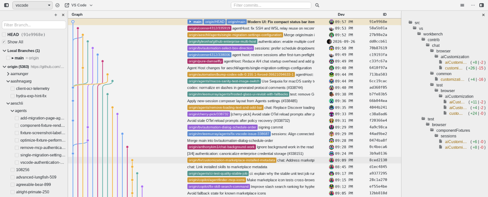

# Commits

A standalone desktop Git client for exploring and working with repositories on Windows and Linux. Commits brings the Git Graph interface to a native app powered by [Bones](vendor/bones/README.md).

  

## Why Commits

Open a repository to browse its commit graph, inspect changes, and use Git actions in one place. The desktop app shares its core and webview with the Git Graph extension while running independently of VS Code.

This is an **AI-driven project**: AI tools help develop and maintain it. People are welcome to contribute with or without AI. **A human reviews every contribution** before it is accepted; contributors should understand and verify the changes they submit. See [Contributing](CONTRIBUTING.md) for the review process.

## Install

1. Download the ZIP for your platform from the [latest release](https://github.com/an-dr/commits/releases/latest): Windows x64, Windows ARM64, or Linux x64.
1. Extract it to a folder and run `commits-app.exe` on Windows or `commits-app` on Linux. On Linux, make the executable runnable if your extraction tool did not preserve its permissions (`chmod +x commits-app`).

## Quickstart

Choose a repository in the app. You can also pass a repository path when launching it from a terminal, for example `./commits-app /path/to/repository` on Linux or `.\commits-app.exe C:\path\to\repository` in PowerShell.

The release ZIP contains the app payload. To build a launcher and install the app from source, follow [Build from source](CONTRIBUTING.md#build-from-source). The installed app can register itself with the desktop and check for updates; [desktop integration](docs/desktop-integration.md) and [updating](docs/updating.md) explain those features.

## Features

- Browse commit history and switch between repositories.
- Inspect commits, changed files, and diffs with syntax highlighting.
- Work with branches and perform Git actions from the graph.
- Open a repository or a folder containing repositories from the command line.

## Configuration

Adjust appearance, desktop behavior, and external tools through [settings](docs/settings.md).

## Documentation

The [documentation index](docs/index.md) links to architecture decisions, configuration, build and release details, and troubleshooting. The [roadmap](ROADMAP.md) records product direction.

### Repository map

| Area | Purpose |
| --- | --- |
| [Desktop app](apps/commits/README.md) | Native host, WebAssembly adapter, and webview |
| [Shared packages](packages/README.md) | Core logic and webview shell |
| [Native crates](crates/README.md) | Reusable operating system capabilities |

## Contributing

Bug reports, documentation improvements, tests, and code are welcome. Start with the [contribution guide](CONTRIBUTING.md), which covers setup, useful areas of the codebase, checks, and pull requests. You can browse [open issues](https://github.com/an-dr/commits/issues) or open an issue to discuss an idea before taking on a larger change.

## License and status

Commits is released under the [MIT license](LICENSE). See [third-party notices](THIRD_PARTY_NOTICES.md) for upstream lineage and dependency terms.

The project is under active development. Releases currently target Windows x64, Windows ARM64, and Linux x64; [CI](docs/ci.md) builds all three and runs tests on Linux x64 and Windows x64.
