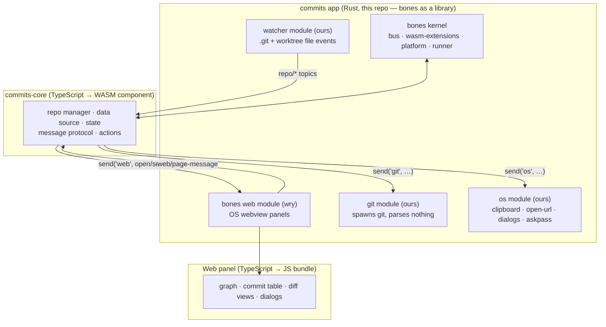

# Roadmap — `commits`, a standalone Git client on bones

## Goal

A standalone desktop Git client built with web technology for its UI, running
on the [bones](vendor/bones) engine. The product logic is the `an-dr-commits`
VS Code extension, ported to TypeScript compiled to a WebAssembly component
that bones loads as an extension. This repository is the foundation the
`an-dr-commits` VS Code extension is later rebuilt on top of, so the ported
core must stay host-agnostic.

Three properties drive every decision below:

1. **Product logic is a WASM extension.** TypeScript in, `.wasm` component
   out, loaded by bones like any other extension (hot reload, sandbox,
   watchdog budgets included).
2. **UI is web technology.** The existing `web/` frontend of the VS Code
   extension is reused nearly as-is inside a bones wry web panel.
3. **One core, two hosts.** The same core TypeScript serves the bones app and
   the VS Code extension; only a thin host port differs.

---

## Architecture target



### Why these boundaries

| Concern | Placement | Reason |
| --- | --- | --- |
| Running `git` | native module | WASI-p2 has no process spawn; a WASM guest cannot fork `git` |
| Parsing `git` output | WASM core (TS) | It is the ported product logic; keeps native modules dumb and swappable |
| File watching | native module | Needs OS watch APIs and threads |
| Clipboard, URLs, native dialogs, `GIT_ASKPASS` | native module | OS surface |
| Graph, table, diffs, dialogs | web panel | Direct reuse of `web/` |
| Repo discovery, state, protocol, actions | WASM core | The thing we are actually porting |

Native modules are injected through bones' `.module(...)` composition root
(ADR-011/ADR-017), so **no changes to the vendored bones WIT world are
required**. `vendor/bones` stays an untouched upstream submodule; anything we
need from upstream goes there as a separate contribution, never as a local
patch.

### Repository layout (target)

```
apps/commits/        the standalone application
  host/                Rust composition root — bones library + our modules
  bones-adapter/       TypeScript guest → commits.wasm
    host/                host port (bones impl; the VS Code impl lives in the
                         extension repo and implements the same interface)
  web/                 TypeScript web panel (ported from an-dr-commits/web)
  scripts/             page, bundle and component builds
crates/git/          native git module (endpoint "git")
crates/watcher/      native repo watcher module (endpoint "watcher")
crates/os/           native OS-surface module (endpoint "os")
ipc/                 wire contract: bones-codec messages, shared by Rust + TS
packages/            MIT code shared with the VS Code extension
vendor/bones/        upstream submodule, read-only
docs/adr/            our decisions
```

---

## Phases

Each increment names a **completion artifact** — something runnable or
inspectable that proves the increment landed. Increments inside a phase are
ordered; phases may overlap only where noted.

### Phase 0 — Foundations

Establish that the toolchain works before porting anything.

| # | Increment | Completion artifact |
| --- | --- | --- |
| 0.1 | Repo scaffolding: workspace, layout above, build scripts, licence/attribution for the MIT `vscode-git-graph` lineage | `cargo build` and `npm run build` succeed on an empty skeleton |
| 0.2 | Rust host app embedding bones as a library with the `web` module enabled | `commits(.exe)` launches, opens an empty wry panel, exits cleanly |
| 0.3 | **TS → WASM spike**: a trivial TypeScript extension built with `jco componentize` against `vendor/bones/wit/core.wit` | `hello.wasm` loads in our app and logs through `host-api::log` |
| 0.4 | TS port of the bones fixed-layout codec (`Reader`/`Writer`, little-endian, no serde) plus the `web` message types | TS unit tests round-trip against Rust-generated fixtures |
| 0.5 | Decision gate + ADR: componentised-JS viability (binary size, cold start, per-message latency) | ADR recording measured numbers and the fallback (move hot parsing into a native module) |

> **Gate 0.5 is the project's main technical risk.** A componentised JS guest
> ships a JS engine inside the `.wasm`; startup cost and parse throughput on
> large `git log` output must be measured before Phase 3 commits to it.

### Phase 1 — Walking skeleton

One vertical slice through every layer, with no Git in it yet.

| # | Increment | Completion artifact |
| --- | --- | --- |
| 1.1 | TS extension opens a web panel and serves a page bundle | App shows a page rendered from `apps/commits/web/`, panel lifecycle events logged |
| 1.2 | `VSCODE_API` shim: `postMessage`/`onmessage`/`getState`/`setState` implemented over the bones page IPC | Existing `web/` code compiles unmodified against the shim |
| 1.3 | Typed request/response protocol between page and core, reusing the extension's `message-protocol` shape | Round-trip echo request visible in the panel |
| 1.4 | Host port interface (`HostPort`) defined; bones implementation behind it | Core module imports no bones symbol directly |

### Phase 2 — Git capability

The native side of everything the VS Code host used to provide.

| # | Increment | Completion artifact |
| --- | --- | --- |
| 2.1 | `git` module: spawn `git` with args + cwd + env, return exit code, stdout, stderr; cancellation; concurrency cap | Rust tests; `send("git", …)` from a TS extension returns real `git --version` output |
| 2.2 | Async-safe request model — long `git` calls must not stall a frame phase (worker thread + reply topic, with the synchronous `send` reserved for cheap calls) | ADR + a deliberately slow `git` call that leaves the UI responsive |
| 2.3 | `watcher` module: watch `.git`, worktree, `commondir`; classify full vs lightweight refresh as `RepoFileWatcher` does today | File touch produces the expected `repo/*` topic in the log |
| 2.4 | `os` module: clipboard, open external URL, native file/folder picker | Each exercised from the walking-skeleton page |
| 2.5 | `GIT_ASKPASS` / `GIT_EDITOR` helpers (port of `src/askpass`, `src/gitEditor`) | Push to an HTTPS remote prompts in-app and succeeds |

### Phase 3 — Core backend port (read path)

Port `src/` product logic to `packages/core/`, VS Code API calls replaced by `HostPort`.

| # | Increment | Completion artifact |
| --- | --- | --- |
| 3.1 | `dataSource` read path: `getRepoInfo`, `getCommits`, `getLog`, the single `for-each-ref` snapshot (ADR-014) and its parsers | Existing `dataSource*.test.ts` suites pass unchanged in the new repo |
| 3.2 | `repositoryGraphCache` + bounded projections (ADR-015) | Existing cache tests pass |
| 3.3 | `repoManager` on `HostPort` discovery instead of VS Code workspace folders | `repoManager` tests pass against a stub host |
| 3.4 | `config` → file-backed settings (JSON on disk) replacing `contributes.configuration` | Settings file schema documented; config tests pass |
| 3.5 | `extensionState` → bones persistence module (ADR-020) via the same interface | State survives an app restart |
| 3.6 | Wire 3.1–3.5 into the WASM extension end to end | Real commits of this repo returned to the page as JSON |

### Phase 4 — Frontend port (read path)

| # | Increment | Completion artifact |
| --- | --- | --- |
| 4.1 | Build pipeline for `apps/commits/web/` mirroring `package-web.js` (concatenated global-scope bundles, CSS concat) | `out.min.js` / `out.min.css` produced and loaded by the panel |
| 4.2 | Theming layer: VS Code CSS variables replaced by our own token set, light + dark | Both themes render correctly; no `--vscode-*` references remain |
| 4.3 | Codicon assets vendored with their licence | Icons render offline |
| 4.4 | Graph + commit table + branch panel live against real data | The app displays this repository's graph |
| 4.5 | Commit details, file tree, find widget, context menus | Feature parity checklist for the read path signed off |

**Milestone M1 — read-only Git client.** Browse repositories, graph, commits,
refs, and file lists. Nothing mutates a repository yet.

### Phase 5 — Diff and file viewing

The largest genuine gap: VS Code supplied the diff editor and file opening.

| # | Increment | Completion artifact |
| --- | --- | --- |
| 5.1 | `diffDocProvider` equivalent: content of a path at a revision, through the `git` module | Arbitrary blob fetched and displayed |
| 5.2 | Built-in diff views (unified + split) reusing `web/main/fullDiffPanel.ts` and its offline highlight.js path (ADR-018) | Side-by-side and unified diffs of a real commit |
| 5.3 | Submodule diff modes (ADR-020/ADR-021 of the extension) | Submodule boundary change rendered as today |
| 5.4 | "Open file" / "reveal in explorer" through the `os` module | Both actions work from the file tree |

### Phase 6 — Write path (Git actions)

| # | Increment | Completion artifact |
| --- | --- | --- |
| 6.1 | Action plumbing: dialogs → core → `git` module → refresh, with error surfacing | One action (checkout branch) works end to end |
| 6.2 | Branch and remote actions (create/checkout/delete/rename/push/pull/fetch/merge/rebase) | Action-by-action parity checklist |
| 6.3 | Commit actions (cherry-pick, drop, reword, revert, reset, squash, edit author) | Parity checklist |
| 6.4 | Tag and stash actions | Parity checklist |
| 6.5 | Working tree: stage / unstage / discard / clean / commit / inline amend (ADR-024) | Commit created from the app |

**Milestone M2 — usable daily-driver client.** Read plus the full action set.

### Phase 7 — Application shell

Everything the VS Code window used to be.

| # | Increment | Completion artifact |
| --- | --- | --- |
| 7.1 | Multi-repository shell: repo list, add/remove, starred repos, recents | Switching repositories without restart |
| 7.2 | Sidebar view ported from `web/sidebar/` as a panel region | Mini-graph and changes tree visible |
| 7.3 | Settings UI over the Phase 3.4 config file, plus per-repo settings widget | Settings changed in-app take effect |
| 7.4 | Window chrome: title, tray icon, menus, keyboard shortcuts, UI density (ADR-017) | Shortcut and density parity checklist |
| 7.5 | Session restore (open repo, view state) via persistence | Reopening the app restores the previous view |
| 7.6 | Inline blame and code review, if kept — both are editor-coupled features and may be dropped for the standalone product | ADR recording keep-or-drop with rationale |

### Phase 8 — Productisation

| # | Increment | Completion artifact |
| --- | --- | --- |
| 8.1 | CI: build + test on Windows, Linux, macOS | Green pipeline on all three |
| 8.2 | Packaged distribution per platform (bones `dist.ps1` extended) | Downloadable artifact that runs on a clean machine |
| 8.3 | Crash/error reporting and structured logs surfaced in-app | Log viewer panel |
| 8.4 | Performance pass against Phase 0.5 budgets on a large repository | Documented timings for load, filter, and diff on a 100k-commit repo |
| 8.5 | Update mechanism | Version check and guided update |

**Milestone M3 — v1.0 release.**

### Phase 9 — Foundation for `an-dr-commits`

Close the loop the goal statement opens: this repo feeds the VS Code
extension, not the other way round.

| # | Increment | Completion artifact |
| --- | --- | --- |
| 9.1 | Publish `packages/core/` as a consumable package (npm workspace or git dependency) | Version pinned and consumed by a scratch project |
| 9.2 | VS Code `HostPort` implementation in the extension repo | Extension boots against the shared core |
| 9.3 | `an-dr-commits` cut over to the shared core, its duplicated logic deleted | Extension test suites pass against the shared core |
| 9.4 | Shared web bundle consumed by both hosts | One frontend codebase, two hosts |
| 9.5 | Release process covering both products from one version stream | Both released from a single tag |

---

## Cross-cutting decisions to record as ADRs

Write these as `docs/adr/` entries when the corresponding increment starts;
none should be settled implicitly in code.

1. **Componentised JS as the guest toolchain** (gate 0.5) — and the fallback
   if throughput fails.
2. **`git` runs native, parsing runs in WASM** — the split that keeps native
   modules dumb.
3. **Long Git calls do not use synchronous `send`** — how request/reply and
   cancellation actually work (bones ADR-010 allows sync `send`; it stalls a
   frame phase, so it is for cheap calls only).
4. **Wire contract lives in `ipc/`**, generated or hand-ported into both
   Rust and TS, never duplicated by hand in two places.
5. **`vendor/bones` is read-only** — upstream contributions instead of local
   patches; the submodule pin is bumped deliberately.
6. **Host port shape** — the interface both the bones app and VS Code
   implement, and what deliberately falls outside it.
7. **Behaviour freeze during the port** — command names, protocol messages,
   and persisted state keys keep their existing shapes so the extension can
   later adopt the shared core without a migration.

## Known risks

| Risk | Phase | Mitigation |
| --- | --- | --- |
| JS-in-WASM startup and parse throughput | 0.5 | Measure at gate; fallback is a native parsing module behind the same protocol |
| No threads / no async in the guest | 2.2 | Native modules own concurrency; the guest stays event-driven (bones ADR-004) |
| Watchdog budgets killing a slow guest handler | 2.2, 3.6 | Keep handlers short; long work belongs to native modules |
| wry webview differences across platforms | 4.x, 8.1 | Cross-platform CI from 8.1, exercised earlier by hand |
| Credential prompts (`GIT_ASKPASS`) | 2.5 | Dedicated increment; do not defer to Phase 6 |
| Scope creep from VS Code-coupled features (blame, code review, editor diff) | 5.x, 7.6 | Explicit keep-or-drop ADR rather than silent porting |
| Divergence between this core and the extension before Phase 9 | 9.x | Behaviour freeze (ADR 7) and an early package boundary |

## Out of scope

* GUI-level Git operations `git` itself cannot perform (custom merge
  algorithms, in-app conflict resolution beyond invoking a merge tool) unless
  a later phase adds them deliberately.
* Hosting provider integrations beyond the existing pull-request URL
  templating.
* Replacing bones' renderer, egui UI, audio, or game-core paths — this
  product uses the web panel backend only.
